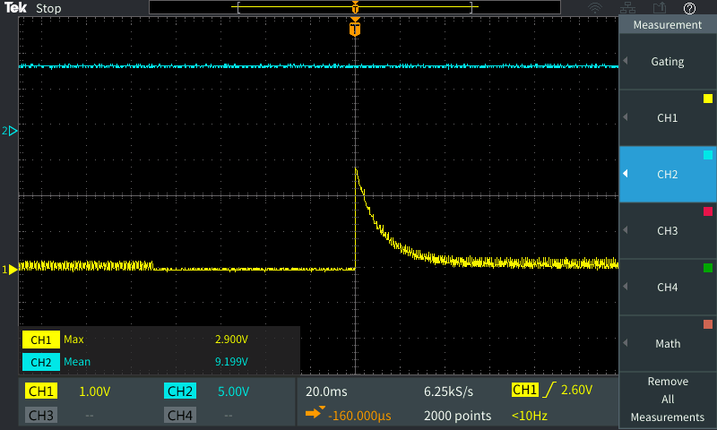

# Yosemitech Modbus

A library to use an Arduino as a master to control and communicate with the sensors produced by [Yosemitech](http://www.yosemitech.com/en/) via [Modbus RTU](https://en.wikipedia.org/wiki/Modbus) over [RS-485](https://en.wikipedia.org/wiki/RS-485).  The communication rate is set at 9600 baud/[8-N-1](https://en.wikipedia.org/wiki/8-N-1).  The default slave ID from the factory is 0x01.

These sensors only support these modbus commands:
* 3 (0x03, Read holding registers)
* 16 (0x10, Write multiple registers)

The implementation of modbus by these sensors is _not_ fully compliant with the [official modbus standards](http://modbus.org/specs.php).  These are some of the irregularities we have found so far:
* The sensors do not act on server broadcast messages (that is, write commands sent to address 0x00).
* The sensors give no response to properly formed requests for data from any registers except those few listed in the modbus manuals.  (See the "doc" folder for copies of the manuals for the sensors we have.)

Another note:  The sensors seem to be somewhat.. finickey about resolving similar addresses when several are connected to the same bus.  I recommend giving the sensors addresses a few numbers away from each other to help separate them on the bus.  (That is, instead of numbering them as 0x01, 0x02, 0x03, 0x04, and 0x05 try 0x01, 0x03, 0x05, 0x07, and 0x09.)

## Hardware

#### Power Supply
All of these sensors require a 5-12V DC power supply and the power supply can be stopped between measurements. Older sensors may require higher voltage power supplies.  Do note that any time the sensor looses power, its internal configurations (such as brushing interval for sensors with wipers) will be reset to their factory values.  The red wire from the sensor should connect to the positive pole of the 5-12V power supply and the black to ground.

**Current Consumption**:
The current consumption of the Yosemitech sensors is specified to be <50mA, this is not accurate for their sensors which include a wiper brush, for these sensors an inductive spike exists when the brush begins to spin, which draws significantly more current than specified. Below is a table describing the current draws for several different opeating conditions of the Yosemitech 511 Turbidity senor (with brush). All tests were driven by a power supply with a 9v output

| Condition        | Current    |   
| ------------- |:-------------:| 
| Brush Starting | <290mA1| 
| Brush Running     | 52mA      |
| Sensing | 27mA     |
| Idle | 7mA |

Note 1: The current on brush start can be seen in the image below, where the yellow line shows current into the sensor with a gain of 10 V/A, and the blue line is the output voltage to the sensor. The spike peak is approximately 290mA, with an exponential decay over the next 10-15ms, while this is short, it is more than enough time to brown out many low current power supplies found in data logger systems, so appropriate percautions must be taken to avoid this problem.

#### RS485 communication/connection:
The sensors need to communicate with the Arduino via a RS485-to-TTL adapter.  The white wire of the Yosemitech sensor will connect to the "B" pin of the adapter and the green wire will connect to "A".  Note that most RS485 adapters require 3.3-5V of power and do NOT provide any power to the sensors.  For adapters that require it, this library does include code to toggle the RE and DE (receive/data enable), though the timing for this is very persnickety.  I recommend an adapter board with built in flow control.  Also, be mindful of the logic level of the TTL output by the adapter.  The MAX485, one of the most popular adapters, has a 5V logic level in the TTL signal.  Up to 247 different devices can be connected in the same RS485 circuit, provided that each sensor has been separately assigned a uniques slave id.

#### Receiving TTL Data:
If possible, always connect the RS485 adapter so the TTL signal is going to a Hardware Serial port on the Arduino.  Hardware serial ports are more stable than software/pin change serial emulation.  If you do not have an available hardware serial port, [AltSoftSerial](https://github.com/PaulStoffregen/AltSoftSerial) is probably the best Arduino alternative, if your board is supported.  [NeoSWSerial](https://github.com/SlashDevin/NeoSWSerial) is also a decent alternative at the Yosemitech's 9600 baud.  Use the standard Arduino SoftwareSerial if nothing else is available, but be aware that some sensors may not respond correctly.

## Suggested setup with an EnviroDIY Mayfly

- We used this [SCM TTL to RS485 Adapter / 485 to Serial Port UART Level Converter Module (XY-017)](https://www.amazon.com/gp/product/B01J9C7JNA), sold by many vendors for $3-10
- We soldered a grove connector to the RS485 adapter so we connect it to the Mayfly's grove ports, but to do this we had to flip the wire configuration of the grove cables (yes, the flipped grove cable can connect in either direction, but I find it a best practice to keep the colors aligned for easy cross-check).
Note the cable colors:
    - Green/Yellow = Transmit (A)
    - White = Receive (B)
    - Red = Power (VCC)
    - Black = Ground
- We have been giving the sensors 5v switched power off an analog grove port on the Mayfly, as you can see in the photo, to keep digital ports open for other sensors.
    - Be sure that the jumper for the analog grove port is in the 5v position.
- We merge the RS485 signals from the adapter board with the 5v power via a 4-port grove hub, which allows us to use a grove screw terminal to receive the bare wires from the sensor.
